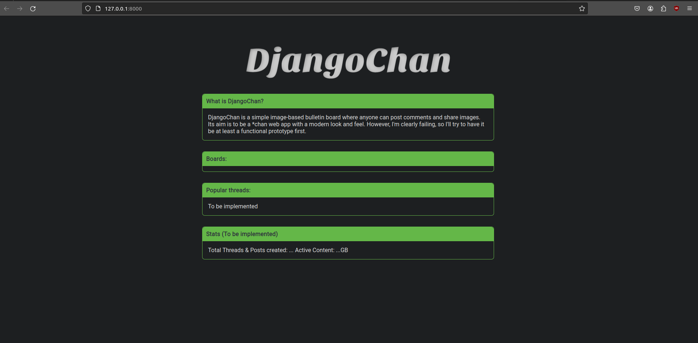

# DjangoChan
An Anonymous Imageboard with Django, probably going to be a 4chan clone.

## Table of contents
1. [Installation](#installation)
2. [Usage](#usage)
3. [Contributing](#contributing)
4. [To-do](#to-do)
5. [License](#license)
   

## Installation
Assuming that you already have git and python installed:  

1.**Clone the repository**

Go in whatever directory you want to download the repository and clone it with:
```bash
git clone https://github.com/giovanni-bandinelli/DjangoChan.git
```

2.**Create and activate a python virtual enviroment**

Navigate to the Djangochan directory in your terminal and run the following commands:

   **on Windows:**

```bash
python -m venv venv
venv\Scripts\activate
```
   **on Mac/Linux:**
```bash
python3 -m venv venv
source venv/bin/activate
```
These commands create a Python virtual environment named 'venv' and activate it, necessary for the next step.

3.**Add requirements**
```bash
pip install -r requirements.txt
```
This ensures that all project dependencies are installed in the virtual environment.

4.**Run migrations**
```bash
python manage.py makemigrations
```
```bash
python manage.py migrate
```
## Usage
After completing the installation,open a terminal inside of the project's directory and run:
```bash
python manage.py runserver
```

This is what you should see:


(notice how the url is something like http://127.0.0.1:8000)

If you want to create boards, you'll need to enter Django's admin interface, but first you have to create a superuser with

```bashUser
python manage.py createsuperuser
```
enter whatever username and password you want.
With that done, navigate to your local development server (http://127.0.0.1:8000 in my example) and add `/admin` to enter the admin interface, log in using your superuser's credentials.
From there on the column on the left you'll be able to manage all the models of the project (board and post), the Board model as of right now has an useless yet required "Description" field, I'll clean it up in the future lol.
et voilà, going back to the homepage you should be able to see the list of boards that you have added to the database.

**reminder**

This repository is still in development stage, Work on deployment mode hasn't started yet 
## Contributing 
At the moment I want this to be a solo project and no contributions will be accepted

## To-do

A list of missing features etc from the moment I wrote this README

### Frontend wise
- [ ] Overhaul of the UI/UX
   - [ ] Implement markdown (greentext,hyperlinks,other?)
   - [ ] Implement draggable reply form
   - [ ] Polish the look and feel of the standard webapp, make it more responsive
   - [ ] Implement a mobile friendly version
   - [x] Deconstruct the spaghetti code that is the frontend side of the application, organize it better

### Backend wise
- [x] Merge Thread and Post model so that they share the same ID
- [ ] Add user model, both anonymous and logged (for admin and mods)

I'll add more stuff going on.

## License

Distributed under the MIT License. See `LICENSE.txt` for more information.
  
  
  


